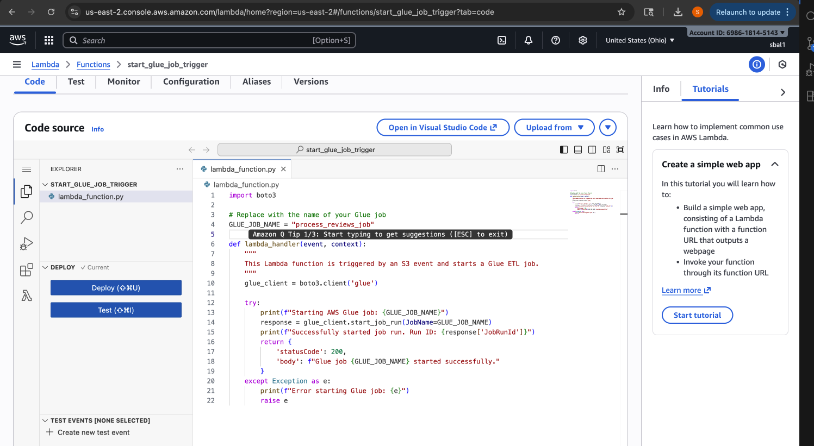
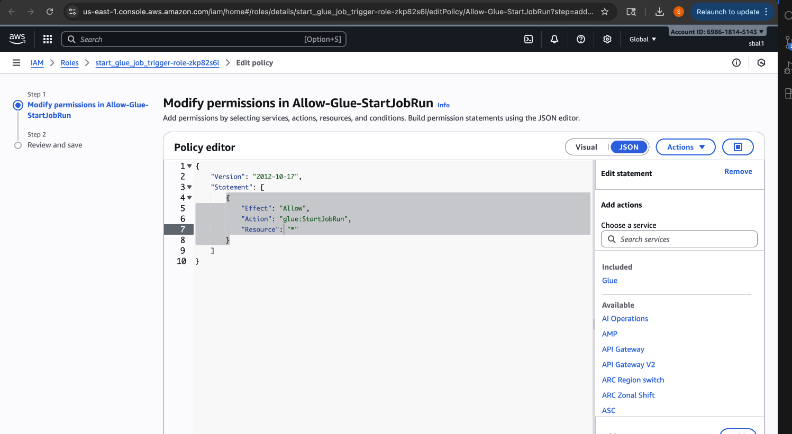
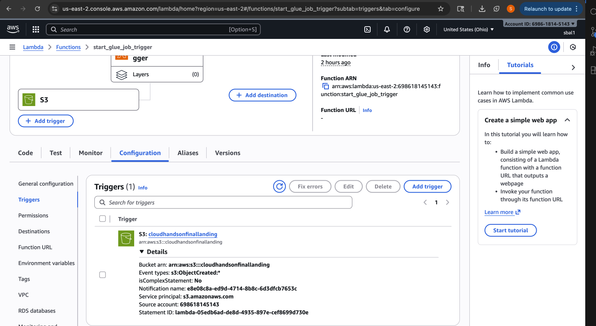
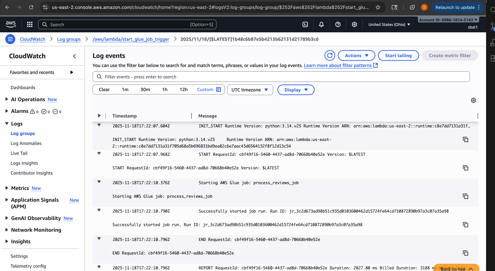
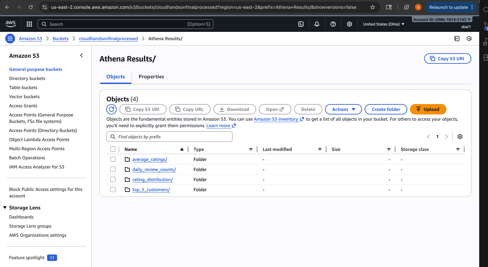
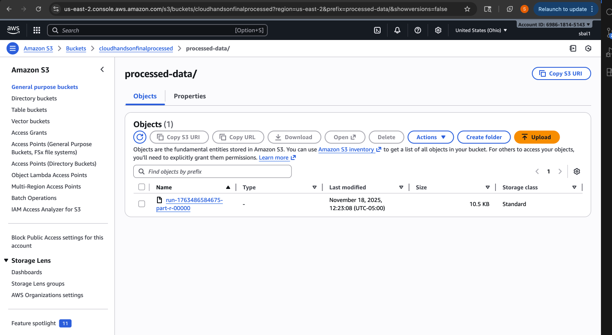
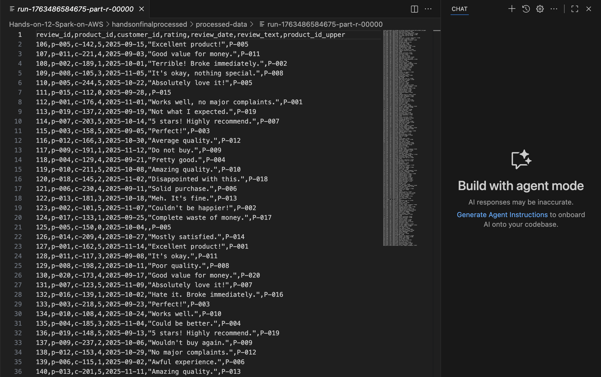
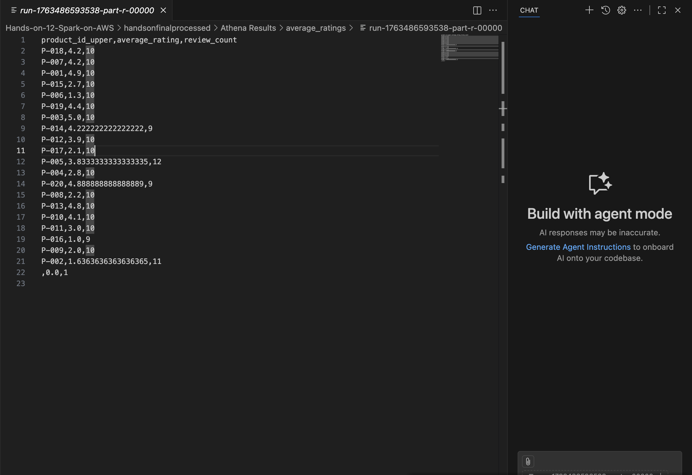
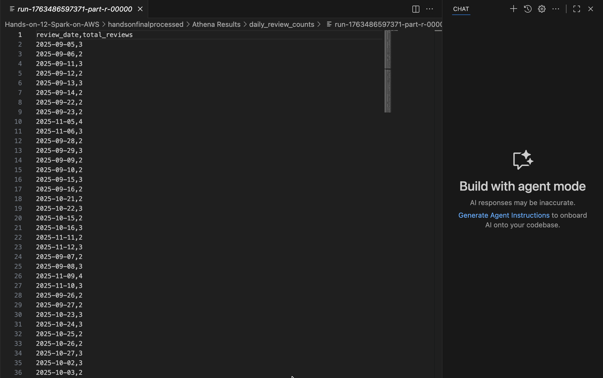
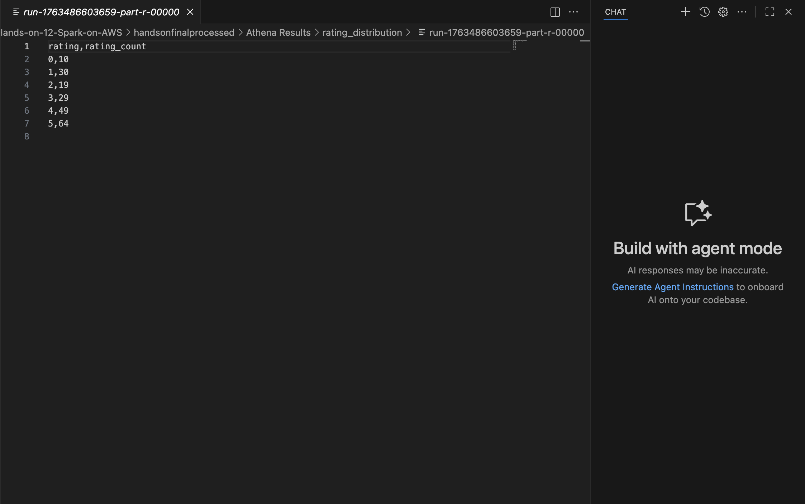

# Hands-on-12-Spark-on-AWS
# Serverless Spark ETL Pipeline on AWS

This project is a hands-on assignment demonstrating a fully automated, event-driven serverless data pipeline on AWS.

The pipeline automatically ingests raw CSV product review data, processes it using a Spark ETL job, runs analytical SQL queries on the data, and saves the aggregated results back to S3.

---

## 📊 Project Overview

The core problem this project solves is the need for manual data processing. In a typical scenario, data lands in S3 and waits for a data engineer to run a job. This project automates that entire workflow.

**The process is as follows:**
1.  A raw `reviews.csv` file is uploaded to an S3 "landing" bucket.
2.  The S3 upload event instantly triggers an **AWS Lambda** function.
3.  The Lambda function starts an **AWS Glue ETL job**.
4.  The Glue job (running a PySpark script) reads the CSV, cleans it, and runs multiple Spark SQL queries to generate analytics (e.g., average ratings, top customers).
5.  The final, aggregated results are written as Parquet files to a separate S3 "processed" bucket.

---

## 🏗️ Architecture


**Data Flow:**
`S3 (Upload) -> Lambda (Trigger) -> AWS Glue (Spark Job) -> S3 (Processed Results)`

---

## 🛠️ Technology Stack

* **Data Lake:** Amazon S3
* **ETL (Spark):** AWS Glue
* **Serverless Compute:** AWS Lambda
* **Data Scripting:** PySpark (Python + Spark SQL)
* **Security:** AWS IAM (Identity and Access Management)

---

## 🔧 Setup and Deployment

Follow these steps to deploy the pipeline in your own AWS account.

### 1. Prerequisites
* An AWS Account (Free Tier is sufficient)
* Basic knowledge of S3, IAM, Lambda, and Glue

### 2. Create S3 Buckets

S3 (Simple Storage Service) is AWS’s object storage service. The landing bucket stores raw input files, and the processed bucket stores cleaned data and analytics outputs.

**Approach**

Create two S3 buckets with globally unique names:
* `cloudhandsonfinallanding`: This is where you will upload your raw data.
* `cloudhandsonfinalprocessed`: This is where the processed data and query results will be stored.


### 3. Create IAM Role for AWS Glue

IAM (Identity and Access Management) roles define permissions for AWS services. The Glue IAM role grants Glue the rights to read from S3, execute ETL operations, and write results back.

**Approach**

Your Glue job needs permission to read from and write to S3.

1.  Go to the **IAM** service.
2.  Create a new **Role**.
3.  Select **AWS service** as the trusted entity and choose **Glue** as the use case.
4.  Attach the `AWSGlueServiceRole` managed policy.
5.  Attach the `AmazonS3FullAccess` policy (for this demo) or a more restrictive policy that only grants access to your two buckets.
6.  Name the role `AWSGlueServiceRole-Reviews` and create it.


### 4. Create the AWS Glue ETL Job

ETL (Extract, Transform, Load) jobs automate data processing. Glue ETL jobs read raw data, clean it, transform it, and prepare analytical datasets.

**Approach**

1.  Go to the **AWS Glue** service.
2.  In the navigation pane, click on **ETL jobs**.
3.  Select the **Spark script editor** option to create a new job.
4.  Paste the contents of `src/Glue ETL Script.py` into the editor.
5.  Go to the **Job details** tab.
6.  Set the **Name** to `process_reviews_job`.
7.  Select the `AWSGlueServiceRole-Reviews` **IAM Role** you created in the previous step.
8.  Save the job.

> **Note:** The script is already configured to use the `cloudhandsonfinallanding` and `cloudhandsonfinalprocessed` buckets.


### 5. Create the Lambda Trigger Function

AWS Lambda is a serverless compute service that runs code in response to events. This Lambda function automatically triggers the Glue ETL job when a new CSV is uploaded.

**Approach**

This function will start the Glue job when a file is uploaded.

1.  Go to the **AWS Lambda** service and **Create function**.
2.  Select **Author from scratch**.
3.  Set the **Function name** to `start_glue_job_trigger`.
4.  Set the **Runtime** to **Python 3.10** (or any modern Python runtime).
5.  **Permissions:** Under "Change default execution role," select **Create a new role with basic Lambda permissions**. This role will be automatically named.
6.  Create the function.


#### 5a. Add Lambda Code

Paste the contents of `src/lambda function.py` into the code editor. Make sure the `GLUE_JOB_NAME` variable matches the name of your Glue job (`process_reviews_job`).



#### 5b. Add Lambda Permissions

The Lambda function needs permissions to invoke other AWS services. An IAM policy is attached to the Lambda role to allow it to start Glue jobs.

**Approach**

The new Lambda role needs permission to start a Glue job.
1.  Go to the function's **Configuration** > **Permissions** tab and click the role name.
2.  In the IAM console, click **Add permissions** > **Create inline policy**.
3.  Use the JSON editor and paste the following policy:
    ```json
    {
        "Version": "2012-10-17",
        "Statement": [
            {
                "Effect": "Allow",
                "Action": "glue:StartJobRun",
                "Resource": "*"
            }
        ]
    }
    ```
4.  Name the policy `Allow-Glue-StartJobRun` and save it.



#### 5c. Add the S3 Trigger

S3 can trigger Lambda functions when certain events occur, such as file uploads. This enables fully automated, event-driven workflows.

**Approach**

1.  Go back to your Lambda function's main page.
2.  Click **Add trigger**.
3.  Select **S3** as the source.
4.  Select your `cloudhandsonfinallanding` bucket.
5.  Set the **Event type** to `s3:ObjectCreated:*` (or "All object create events").
6.  Acknowledge the recursive invocation warning and click **Add**.



---

## 🚀 How to Run the Pipeline

Your pipeline is now fully deployed and automated!

1.  Take the sample `reviews.csv` file from the `data/` directory.
2.  Upload `reviews.csv` to the root of your `handsonfinallanding` S3 bucket.
3.  This will trigger the Lambda, which in turn starts the Glue job.
4.  You can monitor the job's progress in the **AWS Glue** console under the **Monitoring** tab.

---

## CloudWatch Logs

AWS CloudWatch Logs is a monitoring service that collects and stores log files from AWS resources, such as Lambda functions, EC2 instances, and other services. It allows you to track the execution, performance, and errors of your applications in real time.

The snippet shows the Lambda function execution: it logs the initialization (**INIT_START**), function start (**START**), Glue job start message, successful job trigger with the JobRunId, and the function end (**END**) along with execution metrics such as duration, memory used, and billed duration. This helps in auditing, debugging, and monitoring automated ETL pipelines.

**Approach**

Use CloudWatch Logs to verify that the Lambda function correctly triggers the Glue ETL job. Check for any errors or failed invocations, measure execution duration and memory usage, and ensure that the Glue job starts successfully by monitoring the printed JobRunId. Regularly review logs to ensure reliability of the event-driven workflow.



---

## 📈 Query Results

Each analytics query is executed via Spark SQL in the Glue job. The results are converted to DynamicFrames and written as Parquet files to separate folders for easy querying and visualization using Athena or other tools. After the job (which may take 2-3 minutes to run), navigate to your `cloudhandsonfinalprocessed` bucket. You will find the results in the `Athena Results/` folder, organized into sub-folders for each query:

The Glue ETL job generates multiple analytics reports, each saved as Parquet files in the `cloudhandsonfinalprocessed` bucket:





- **Cleaned Dataset:** s3://cloudhandsonfinalprocessed/processed-data/ – contains the full cleaned CSV converted to a standard format.



- **Average Ratings per Product:** s3://cloudhandsonfinalprocessed/Athena Results/average_ratings/ – lists each product and its average rating.



- **Date-wise Review Counts:** s3://cloudhandsonfinalprocessed/Athena Results/daily_review_counts/ – shows total reviews submitted each day.



- **Top 5 Most Active Customers:** s3://cloudhandsonfinalprocessed/Athena Results/top_5_customers/ – identifies the customers with the most reviews.


- **Rating Distribution:** s3://cloudhandsonfinalprocessed/Athena Results/rating_distribution/ – provides counts for each star rating.



---
## 🧹 Cleanup

To avoid any future charges (especially if you're on the Free Tier), be sure to delete the resources you created:
1.  Empty and delete the `handsonfinallanding` and `handsonfinalprocessed` S3 buckets.
2.  Delete the `start_glue_job_trigger` Lambda function.
3.  Delete the `process_reviews_job` Glue job.
4.  Delete the `AWSGlueServiceRole-Reviews` IAM role.

---